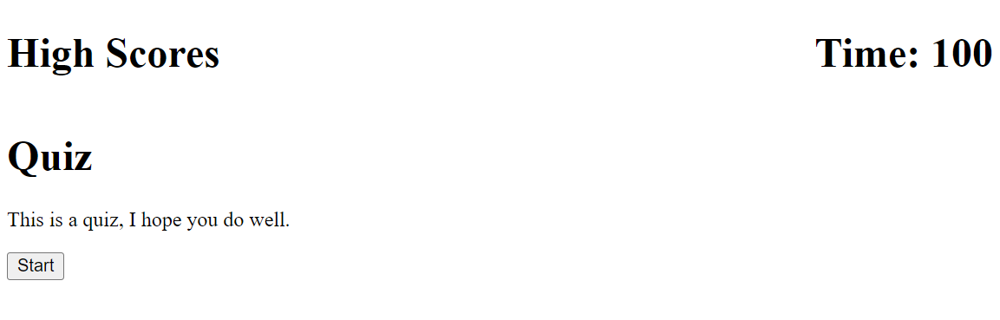

# code-quiz
# password-generator

<a href="https://laurencaudle1234.github.io/code-quiz/">Project</a>

What was my motivation?

My motivation was to generate a quiz for others to take that includes the following acceptance criteria:

GIVEN I am taking a code quiz
WHEN I click the start button
THEN a timer starts and I am presented with a question
WHEN I answer a question
THEN I am presented with another question
WHEN I answer a question incorrectly
THEN time is subtracted from the clock
WHEN all questions are answered or the timer reaches 0
THEN the game is over
WHEN the game is over
THEN I can save my initials and my score

Why did I build this project?

I built this project to enable a quiz and become familiar with Web-API's. 

What problem did I solve? 

I solved the problem of figuring out how to build in javascript to ensure the above criteria is met. 

What did I learn?

I learned that through javascript I can create certain coding language to ensure guidelines are met. 